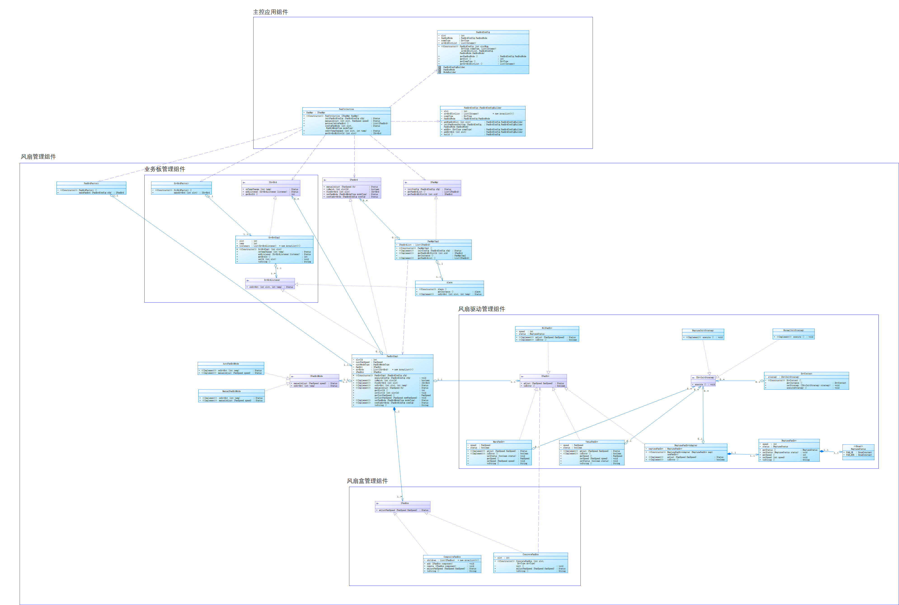

# 风扇转速-设计模式专题

> 设计模式实践Demo

## 设计

### 类图及关键类

> 文档无法清晰显示类图，查看完整类图pdf文件 [新老风扇板统一调速类图](pics/清晰-新老风扇板统一调速类图.pdf)



根据此项目设计，可以分为以下模块和对应的类

1. 主控应用组件
   1. **FanCtrlAction**：主控应用，位于主控板上的应用层，对外提供接口，调用风扇管理实体完成功能
   2. **FanBrdConfig**：描述风扇板的初始化配置信息，包括风扇板的唯一标识 slot 槽位
   3. **FanBrdConfig**::FanBrdConfigBuilder: **Builder模式的体现**，用于构建FanBrdConfig实体
2. 风扇管理组件
   1. **IFanMgr**：风扇管理的抽象接口，提供统一的风扇操作方法描述
   2. **FanMgrImpl**：风扇板控制实现，实现 IFanMgr 接口
   3. **IFanBrd**：风扇板的抽象接口。位于风扇板的领域层，实现逻辑风扇板的控制逻辑
   4. **FanBrdImpl**：风扇板实现类，实现 IFanMgr 接口，实现业务逻辑
   5. **FanBrdFactory**：创建风扇板对象的**简单工厂类**，根据 FanBrdConfig 来创建风扇板实例
   6. **IFanBrdMode**：描述风扇模式的接口，有自动模式和手动模式两种实现类
      1. **AutoFanBrdMode**
      2. **ManualFanBrdMode**
   7. **Alarm**：报警上报业务类
3. 业务板管理组件
   1. **ISrvBrd**：接口，描述业务板逻辑
   2. .**SrvBrdImpl**：实现 ISrvBrd 接口，主要关注温度相关的逻辑
   3. .**SrvBrdListener**：接口，作为业务板温度的**观察者接口，是观察者模式的体现**
   4. **SrvBrdFactory**：创建业务板对象的简单工厂类
4. 风扇板驱动组件
   1. **IFanDrv**：接口，描述驱动的有关逻辑；以下的类实现了此接口，代表了特定的驱动类型
      1. **MarsFavDrv**
      2. **VenusFavDrv**
      3. **NeptuneFanDrvAdapter：NeptuneFanDrv**与IFanDrv接口不同，需要Adapter进行转接，是**适配器模式**的体现
      4. **NeptuneFanDrv**：不同于MarsFavDrv和VenusFavDrv的接口
      5. **NilFanDrv**：代表“空”驱动
   2. **IDevStrategy**：接口，描述实现风扇板创建策略，分为一下两种策略，是**策略模式的体现**
      1. **NeptuneInitStrategy**
      2. **NormalInitStrategy**
      3. **DrvContext**：上下文，保存当前策略情景
5. 风扇盒管理组件
   1. **IFanBox**：接口，描述各个风扇盒的行为。提供了一个调节风扇盒转速的方法。**体现了组合模式**。
   2. **CompositeFanBox**：IFanBox的实现类。代表了嵌套的风扇盒，它内部会有更多的子IFanBox。
   3. **ConcreteFanBox**：IFanBox的实现类。具体承载业务的风扇盒，承载具体业务，作为“叶子结点”

### 业务时序图
[seq.md](pics/seqs/seq.md)

## 设计模式

### 工厂模式

本例中FanBrdImpl 对象是通过初始化配置命令构建出来的，工厂屏蔽创建过程和资源依赖，服务于生命周期管理，本案例工厂只需要创建风扇板一种产品，引入简单工厂，满足 简单设计原则。工厂类通过唯一的静态方法，通过配置文件来生产出对应的风扇板实例。

```java
public class FanBrdFactory {
    public static IFanBrd makeFanBrd(FanBrdConfig cfg) {
        ...// 构建的细节
        return new FanBrdImpl(cfg);
    }
}
```

### 单例模式

以本案例中风扇管理为例，其对象实例全局唯一，引入单例模式，私有化其构造方 法，一个静态私有对象作为唯一实例，通过唯一的静态方法供外部获取该实例的引 用，内部通过双重锁机制防止单例性质遭到破坏。

```java
public class FanMgrImpl implements IFanMgr {
    private static FanMgrImpl instance; // 唯一单例的引用

    private FanMgrImpl() {} // 私有化其构造方法，不允许从外部创建对象
    
    // 双重锁，确保唯一的单例
    public static FanMgrImpl getInstance() {
        if (instance == null) {
            synchronized (FanMgrImpl.class) {
                if (instance == null) {
                    instance = new FanMgrImpl();
                }
            }
        }
        return instance;
    }
}

// 获取单例
FanMgrImpl fanMgr = FanMgrImpl.getInstance();
```

### 适配器模式

海王星厂家比较强势，接口与系统定义的不一致。适配器为NeptuneFanDrvAdapter，NeptuneFanDrv与IFanDrv接口不同，需要Adapter进行转接，是适配器模式的体现。

```java
// 一般的接口设置
public class MarsFanDrv implements IFanDrv {
    private FanSpeed speed;
    private boolean status;
}

// NeptuneFanDrv的方法和属性均与一般定义不同
public class NeptuneFanDrv {
    private int speed;
    private NeptuneStatus status;
    ...
}

public class NeptuneFanDrvAdapter implements IFanDrv {
    @Override
    // 在这里实现接口方法的转换
    public Status adjust(FanSpeed fanSpeed) {
        neptuneFanDrv.setSpeed(fanSpeed.getSpeed());
        return Status.getSuccessStatus("[NeptuneFanDrvAdapter] speed set, "+neptuneFanDrv.toString());
    }

    @Override
    public boolean isError() {
        return neptuneFanDrv.getStatus() == NeptuneStatus.FAM_OK;
    }
}
```

### 观察者模式

观察者模式 每块风扇板持有多块业务板，业务板温度变化通知调用风扇板调速，存在循环依赖。 定义对象间的一种一对多的依赖关系，当一个对象的状态发生改变时，所有 依赖于它的对象都得到通知并被自动更新。 在本例中，作为观察者的有：FanBrdImpl、Alarm，它们订阅了业务板温度变化的事 件，实现了 SrvBrdListener 接口。当业务板发生温度变化时，作为主题 Subject 的 SrvBrdImpl 会遍历其拥有的观察者列表并调用它们的 `onSrvHot` 方法，从而实现这 些这些对象针对温度变化开展的不同行为，如自动调节风扇转速降温、发出警告等。

```java
// 观察者接口
public interface SrvBrdListener {
    Status onSrvHot(int slot, int temp);
}

// Alarm订阅了这个事件
public class Alarm implements SrvBrdListener {
    @Override
    public Status onSrvHot(int slot, int temp) {
        System.out.println("[Alarm] slot: "+ slot+", temperature is " + temp);
        ...
    }
}

public class SrvBrdImpl implements ISrvBrd{
    List<SrvBrdListener> listeners = new ArrayList<>();
   
    @Override
    public Status onTempChange(int temp) {
        // 事件发生时通知所有的订阅者
         for (SrvBrdListener listener : listeners) {
            Status status = listener.onSrvHot(slot, temp);
            ...
        }
        return Status.getSuccessStatus("state hot");
    }
}
```

### 策略模式

使用接口即使用strategy，用于隔离变化。简化复杂的条件，将各种驱动的初始化策略抽象出来，通过Context注入实现简化

```java
public interface IDrvInitStrategy {
    void execute();
}

public class NormalInitStrategy implements IDrvInitStrategy {
    @Override
    public void execute() {
        System.out.println("[NormalInitStrategy] execute NormalInitStrategy");
    }
}

// 上下文
public class DrvContext {
    private IDrvInitStrategy strategy;
  
    public void setStrategy(IDrvInitStrategy strategy) {
        this.strategy = strategy;
    }

    public void executeStrategy() {
        if (strategy == null) return;
        strategy.execute();
    }
}
```

### 组合模式

将组件组装为整体使用。FanBrdImpl通过IFanBox的接口对所有风扇盒进行统一的转速调整，CompositeFanBox的存在允许风扇盒嵌套风扇盒的情况出现，ConcreteFanBox：具体承载业务的风扇盒，承载具体业务，作为“叶子结点”

```java
public interface IFanBox {
    Status adjustFanSpeed(FanSpeed fanSpeed);
}

public class ConcreteFanBox implements IFanBox{
    @Override
    public Status adjustFanSpeed(FanSpeed fanSpeed) {
   		...// 具体业务
        return fanDrv.adjust(fanSpeed);
    }
}

public class CompositeFanBox implements IFanBox{
     private final List<IFanBox> children = new ArrayList<>();
    
     @Override
     public Status adjustFanSpeed(FanSpeed fanSpeed) {
        for (IFanBox component : children) {
            Status ret = component.adjustFanSpeed(fanSpeed); // 触发子节点的具体方法
            if (!ret.isSuccess()) return ret;
        }
        return Status.getSuccessStatus("[CompositeFanBox] operation done for children");
    }
}
```

### 构建器模式（Builder）

该模式包含了对象构造的若干过程，在Java中以优雅的链式调用的形式构建出具体的配置。FanBrdConfig是以这样的方式构建出来的。

```java
        fanCtrlAction.initFanBrdConfig(
                new FanBrdConfig.FanBrdConfigBuilder()
                        .addFanBrdSlot(fanBrd1Slot) // 配置风扇板插槽号
                        .addDrv(DrvType.Mars) // 风扇板默认驱动，适应老版风扇板的情况
                        .addSrvBrd(20001)
                        .addSrvBrd(20002) // 配置了两个业务板，槽位号分别为20001, 20002
                        .initFanBoxesSetting(fanBoxNode1) // 配置风扇盒层级和驱动
                        .build() // 提交
        );
```

## Testcase

描述见代码注释

```java
	    FanCtrlAction fanCtrlAction = new FanCtrlAction(FanMgrImpl.getInstance());
        int fanBrd1Slot = 10000; // 风扇板1的槽位号

	    /* 风扇盒层次设置配置，使用组合模式
	     * 风扇板槽位为10000
	     * --> 风扇盒10000-10, 驱动Mars
	     * --> 风扇盒10000-11, 有两个子风扇盒
	     *    --> 10000-11-110, 驱动Mars
         *    --> 10000-11-111, 驱动Mars
	     */
        FanBrdConfig.FanBoxNode fanBoxNode1 = new FanBrdConfig.NodeBuilder(fanBrd1Slot)
                .addChild(
                        new FanBrdConfig.NodeBuilder(10, DrvType.Mars)
                )
                .addChild(
                        new FanBrdConfig.NodeBuilder(11)
                                .addChild(new FanBrdConfig.NodeBuilder(110, DrvType.Neptune))
                                .addChild(new FanBrdConfig.NodeBuilder(111, DrvType.Mars))
                )
                .build();

        // 初始化风扇板配置
        fanCtrlAction.initFanBrdConfig(
                new FanBrdConfig.FanBrdConfigBuilder()
                        .addFanBrdSlot(fanBrd1Slot) // 配置风扇板插槽号
                        .addDrv(DrvType.Mars) // 风扇板默认驱动，适应老版风扇板的情况
                        .addSrvBrd(20001)
                        .addSrvBrd(20002) // 配置了两个业务板，槽位号分别为20001, 20002
                        .initFanBoxesSetting(fanBoxNode1) // 配置风扇盒层级和驱动
                        .build()
        ).showStatus();

        // 默认为自动挡的情况下，此时进行的调速应该失败
        fanCtrlAction.manualAdjust(10000, FanSpeed.FAN_SPEED_HIGH).showStatus();
        // 查询一块不存在的风扇板，失败
        fanCtrlAction.manualAdjust(10004, FanSpeed.FAN_SPEED_MID).showStatus();

        // 将slot为10000的风扇板的模式改为手动挡
        fanCtrlAction.configFanMode(10000, FanBrdModeType.Manual).showStatus();
        // 设置为手动挡之后调速
        fanCtrlAction.manualAdjust(10000, FanSpeed.FAN_SPEED_HIGH).showStatus();

        // 根据槽位号查找业务板，模拟采集到的温度先后为100和40
        fanCtrlAction.configFanMode(10000, FanBrdModeType.Automatic).showStatus();
        fanCtrlAction.onSrvTempChanged(20001, 100);
        fanCtrlAction.onSrvTempChanged(20001, 40);
```


