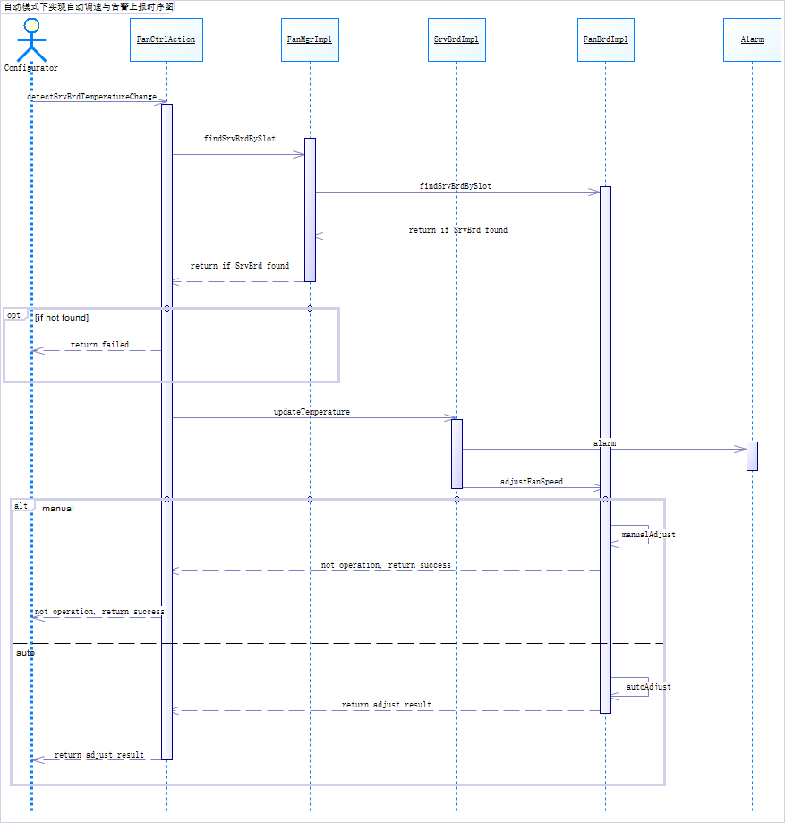
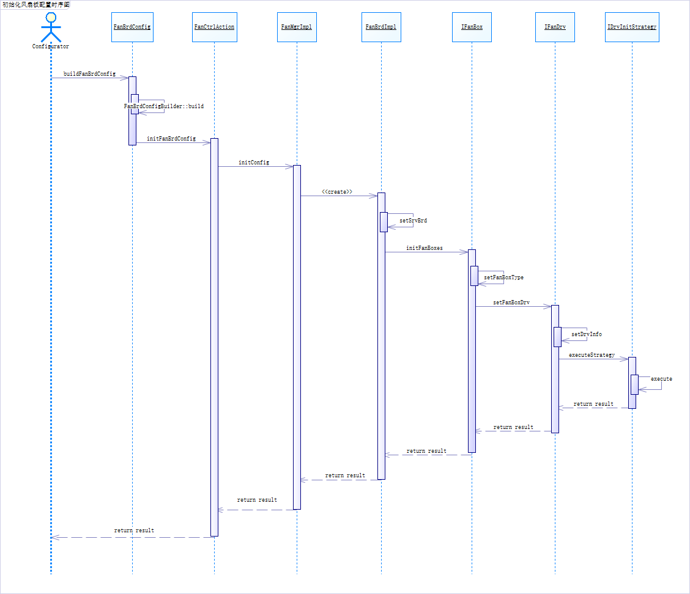
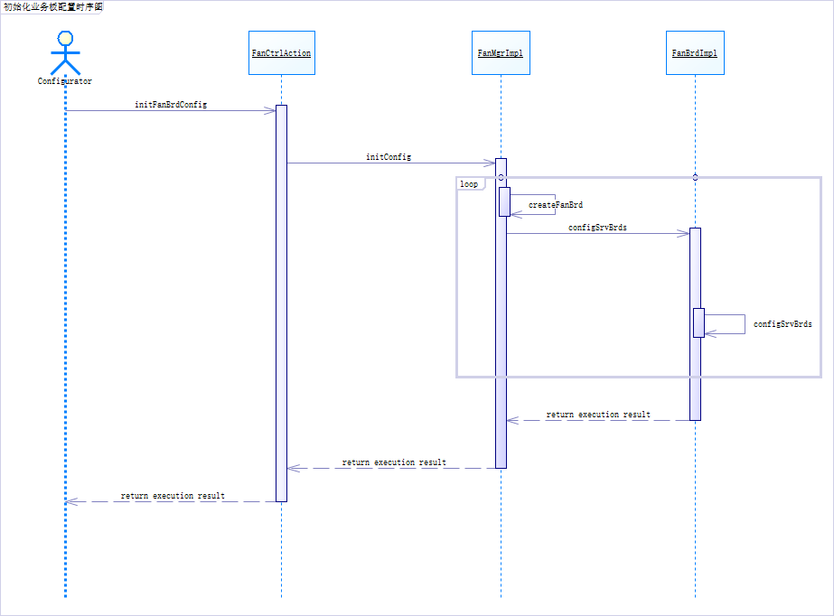

# 时序
## 执行主控调速命令(新风扇板)的时序图

> 完整pdf文件 [(清晰-执行主控调速命令(新风扇板)的时序图)](清晰-执行主控调速命令(新风扇板)的时序图.pdf)

的时序图.png)

公司新引入厂家的风扇板支持按风扇盒配置转速且不同盒子配置不同版本的驱动；假设同一块风扇板的所有盒子只允许设置成相同转速。

FanBrdImpl通过IFanBox的接口对所有风扇盒进行统一的转速调整，CompositeFanBox的存在允许风扇盒嵌套风扇盒的情况出现。IFanBox最后会调用每个风扇盒独有的风扇驱动进行调速，适配器模式允许接口不同于IFanDrv的驱动接入。

## 配置风扇板的工作模式时序图（手动/自动）

.png)

配置器通过主控应用（FanCtrlAction）发出设置配置文件的请求，主控应用通 过调用主控板领域层中的风扇管理（FanMgr）完成功能。首先查找是否存在此风扇 板实例，若无则返回错误信息；若有，给主控应用返回风扇板对象的引用，调用其 修改状态的方法进行修改，最后逐层返回执行结果。

## 自动模式下实现自动调速与告警上报时序图

配置器通过主控应用（FanCtrlAction）发出调节档位的请求，通过风扇板的唯 一标识 slotId（sid）区别每个风扇板对象，主控应用通过调用主控板领域层中的 风扇管理（FanMgr），首先查找是否存在此风扇板实例，若无则返回错误信息；若有， 给主控应用返回风扇板对象的引用，调用其调整转速的方法进行温度调整。自动模 式下手工配置风扇板档位需报错，手动模式下不会根据业务板温度执行任何操作； 业务板的温度超出警戒值时调用 Alarm 类上报

## 初始化风扇板配置时序图

配置器首先根据FanBrdConfig提供的Builder来构建具体的配置信息，交给主控应用开始执行。风扇板根据配置信息创建对应的风扇盒，再为每个风扇盒配置相应的驱动。

## 初始化业务板配置时序图

风扇板根据配置信息创建对应的业务板，代表业务板的逻辑。